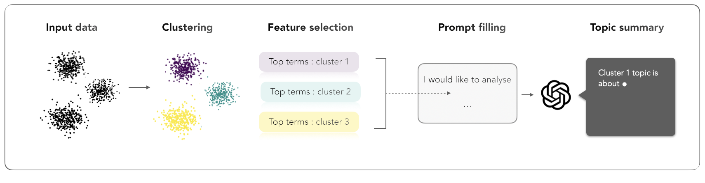

# Regularized Chi-squared Weighted k-means (RCW-kmeans)

**Rcwk** is a simple and efficient Python implementation of a feature-weighted K-Means clustering algorithm tailored for text data. It is particularly useful for exploring and interpreting large textual corpora. Rcwk introduces a feature weighting mechanism that helps identify the most informative words within each cluster.

This project is lightweight, easy to run, and designed to be used as a base for testing initialization strategies, parameter tuning, or cluster analysis. It also includes tools to assist in visualizing clustering results and supports using Large Language Models (LLMs) like ChatGPT as a post-processing step to summarize and interpret clusters.

The image below illustrates the overall workflow of the proposed solution.


## Project Structure

```
Rcwk/
├── coclust/               # Implementation of spherical k-means
├── new_data/              # Benchmark datasets
├── Rcwk/                  # Main source code
    ├── rcwk.py            # Core functionnalities of Rcwk
    └── top_terms_utils.py # Visualization of top terms utilities
├── requirements.txt       # Python dependencies
├── Dockerfile             # Docker image
├── docker-compose.yml     # Docker Compose configuration
└── README.md              # This file
```

## Quick Start with Docker

Make sure Docker and Docker Compose are installed on your machine. Then run:

```bash
git clone https://github.com/MLDS-AF/Rcwk.git
cd Rcwk
docker-compose up --build
```

This will start a Jupyter Lab server accessible at [http://localhost:8888](http://localhost:8888). The default token and password are : 1234567890

## Manual Execution (Without Docker)

1. Create a virtual environment:

   ```bash
   python -m venv .venv
   source .venv/bin/activate  # On Windows: .venv\Scripts\activate
   ```

2. Install the dependencies:

   ```bash
   pip install -r requirements.txt
   ```

3. Launch Jupyter Lab:

   ```bash
   jupyter lab
   ```

## Key Features

- Implementation of K-Means with various initialization strategies: `random`, `s-kmeans`, `k-means++`
- Performance evaluation using NMI, ARI, and Silhouette Score
- Result visualization and parameter tuning

## Rcwk Usage Example

We propose two jupyter notebooks to demonstrate how to use the Rcwk algorithm. The
[Simple usage of Rcwk](notebooks/Simple%20usage%20of%Rcwk.ipynb) notebook contains simple usage example on benchmark datasets: fit the model, evaluate clustering results, extract top terms, etc. And the
[Visualization of Rcwk results](notebooks/Visualization%20of%20and%20analysis.ipynb) notebook contains evaluation experiments.

Here is a basic example of using Rcwk with the BBC News dataset, along with an explanation of how to use the core class:

```python
# BBC News Example
from rcwk import Rcwk

# Load and transform data
mat_tfidf  # your preprocessed feature matrix
k = 5      # number of clusters

# Initialize and fit the Rcwk model
model = Rcwk(n_clusters=k, init="s", random_state=42)
model.fit(mat_tfidf)

# Access results
labels = model.labels_            # Cluster labels for each point
weights = model.weights_           # Feature weights
centers = model.cluster_centers_  # Coordinates of cluster centers
inertia = model.P2                # Sum of squared errors
```

**Usage Summary:**

- `fit(X)`: trains the clustering model on your data matrix `X`.
- `.labels_`: provides cluster assignments after fitting.
- `.cluster_centers_`: contains the centroids of the clusters.
- `.inertia_`: evaluates compactness of clustering (lower is better).

You can switch initialization methods with `init="r"` for random, `"s"` fror spherical k-means, or `"k"` for k-means++.python

## Contributing

Contributions are welcome! If you have suggestions or bug fixes, feel free to open an issue or a pull request.

## License

This project is licensed under the **Creative Commons Attribution-NonCommercial 4.0 International (CC BY-NC 4.0)**.
You are free to use, share, and adapt the work **for non-commercial purposes**, provided that appropriate credit is given.

See the full license text at [creativecommons.org/licenses/by-nc/4.0](https://creativecommons.org/licenses/by-nc/4.0/).
